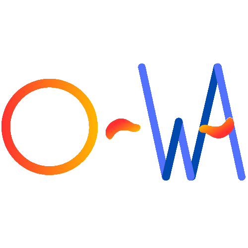

# What is O-WA ?


O-WA (OBS Web App) is an easy to use Scoreboard and Streamdeck web app for OBS that changes name of players, scores and scenes.
It does API calls to StartGG to get the matches yet to be played\
I developped it for my association USDEM 404.


## Introduction

Let's say you want to create an OBS plugin but you don't have
the time or the ressources to do so (like me).

With OBS Docks there is no need to !!\
Because you will access your application through an URL which can be host locally

Using <b>Python</b>, <b>Flask</b>, <b>startggapi</b>, <b>obswebsocket</b> and a little of <b>HTML / CSS / JS</b> you can have a local website 
making API calls to a python program that either does a websocket call to OBS to change names, scores and scenes or another API call (with startggapi) to 
StartGG that generate a DICT of the matches to be played.
#### Add the web app using the docks functionality of OBS

#### Open the docks in OBS

#### See the result


## How to setup
### Prerequisites
You need to have a Python 3.13+ (i did not test it for older version)
- Clone the repo using ```git clone https://github.com/Atomme1/O-WA.git``` 
- Then use ```pip install -r requirements.txt``` to install the dependencies
  - **CHECK WIP BELOW !!**
- Create an account on startgg and create a private token for making API calls.
- Then you need to create a `config.toml` file containing the informations below
#### config.toml example
````toml
[TOKEN_STARTGG]
start_gg_token = "<YOUR_TOKEN_HERE>"

[OBS_WEBSOCKET]
pwd_obs = "<YOUR_PWD_HERE>"
ipv4_obs = "localhost"

[STARTGG_TOURNAMENT_SLUG]
startgg_link = "<YOUR_TOURNAMENT_LINK_HERE>"
#"https://www.start.gg/tournament/let-s-play-iv-2/event/1v1-smash-ultimate"
````
- After that you can run the flask server
#### Run it like a pro
```
flask --app .\FLASK_APP_OBS_STARTGG.py run --host=0.0.0.0 
```
# [WIP] Upgrade on StartGG-API 
I have forked the StartGG-API repo to add some upgrades like getting the event slug + the IDs of the phases and the pools.
And get the sets in the pool that are in a phase. e.g. all sets from Pool B301 from phase R1 of ssbu single from genesis-x2

#### If you want this version of lib
You need to:
- Clone the StartGG-API I have forked
- Run the command ```python -m build``` to build the startggapi with the upgrades
- Then run ```python3 -m pip install .\dist\startggapi-0.1.22-py3-none-any.whl```

## Useful links

The main librairy used is startggapi : https://github.com/Caja-de-Dano/StartGG-API

OBS-Websocket documentation https://github.com/obsproject/obs-websocket/blob/master/docs/generated/protocol.md

The external software I used for keeping up with the score of the players: 
https://obsproject.com/forum/resources/another-scoreboard-application.827/ \
This simple scoreboard application allows me to load a CSV of the matches to be played, but it was limited and could not
be implemented inside OBS.

Check this repo https://github.com/PyroPM/ggapi/blob/main/src/lib.rs to check out their graphql query.
## Known issues

First of all, this small project is not going have major updates since I don't use it at larger scale.

But i know it's flawed in some aspects like :

- ### I don't find the matches for the players of "name of game" in the generated list of matches

#### SOLUTION :  Change `startgg_link` in `config.toml`

- ### For a very large tournament like genesis-x2 it takes time and i have more than 1200 results

#### SOLUTION : It is normal, change the query to get a pagination

The startggapi is not built for pagination, it's good and sometimes bad when you it returns a lot of results.
Unlike pysmashgg that did pagination but was not consistent for me and not future proof.

- ### In a large tournament, I don't have the name of Pool people are

#### SOLUTION : It is normal, this information is not retrieved by the query

If you look-up the group a match is played in startgg, you will see "round 1" and "winner final" in per se "Pool A217".
The tile of the match is generated by startgg inside the pool, so it's normal that you have more than 1 winner final in your list of sets in O-WA.

I did investigate startgg API queries, it is possible to get this data. But i need to refacto startggapi. 


### Utils
In developper portal of startgg API Explorer to make graphql query in « Headers »
```
{
  "Authorization": "Bearer ***************" 
}
```
