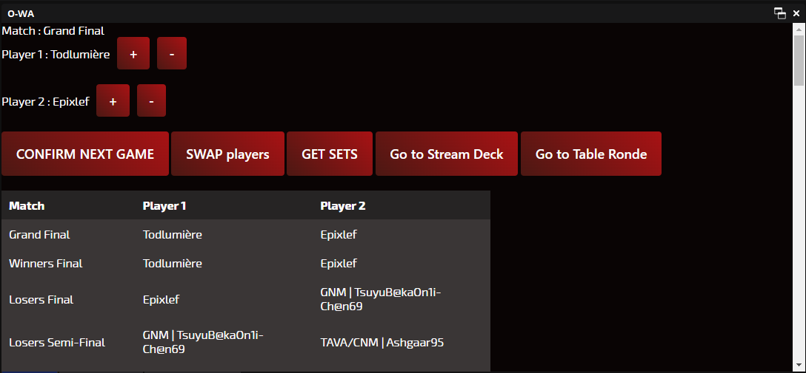

# GG_scoreboard
GG_scoreboard is an easy to use scoreboard web app for OBS that changes name of players and scores.
It also does API calls to StartGG to get the matches to be played\
I developped it for my association USDEM ESPORT 404.


## Introduction

Let's say you want to create an OBS plugin but you don't have
the time or the ressources to do so (like me).

With OBS Docks there is no need to !!\
Because you will access your application through an URL which can be host locally

Using <b>Python</b>, <b>Flask</b>, <b>PySmashGG</b>, <b>obswebsocket</b> and a little of <b>HTML / CSS / JS</b> you can have a local website 
making API calls to a python program that either does a websocket call to OBS to change names and scores or another API call (with PySmashGG) to 
StartGG that generate a DICT of the matches to be played.
#### Add the web app using the docks functionality of OBS

#### Open the docks in OBS

#### See the result


## How to setup

### Prerequisites
You need to have a Python 3.8+ (i did not test it for older version)\
Clone the repo using ```git clone https://github.com/Atomme1/GG_scoreboard.git``` \
Then use ```pip install -r requirements.txt``` to install the dependencies
- Flask
- PySmashGG
- obswebsocket
- Pickle (for dict)
- Pandas (for csv)


### Installing
Step-by-step instructions on how to install this project.
Watch the video below :)

## Useful links

The main librairy used is PySmashGG :https://pypi.org/project/pysmashgg/

The external software I use for keeping up with the score of the players: 
https://obsproject.com/forum/resources/another-scoreboard-application.827/ \
This simple scoreboard application allows me to load a CSV of the matches to be played.
With this 